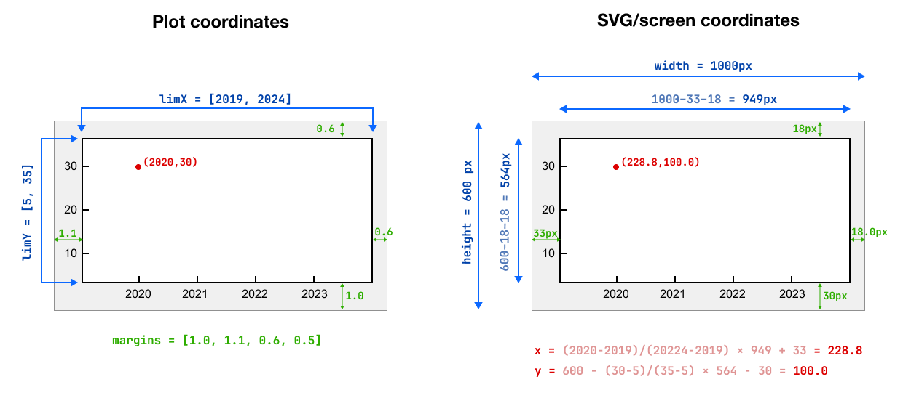

# Svelte components for creating plots

`svelte-plots-basic` is a [Svelte](https://svelte.dev) component library for making simple responsive 2D and 3D plots/charts. The plots are created by generating [SVG](https://en.wikipedia.org/wiki/Scalable_Vector_Graphics) inside HTML document.

One can think of this library as "Lego" bricks for plots. It has two groups of components: for 2D and for 3D plots. The 2D components are more developed while 3D components remain quite basic. In addition to `svelte`, the package has one direct dependence, [mdatools-js](https://github.com/svkucheryavski/mdatools-js) library, which is used for vector/matrix operations, statistics, and other manipulations with data values.


## Showcase

These websites and web-applications use `svelte-plots-basic` library:

* [graasta.com](https://graasta.com) — interactive web-apps for learning statistics and beyond.
* [mda.tools/ddsimca/](https://mda.tools/ddsimca/) — interactive web-app for one class classification using [DD-SIMCA](https://analyticalsciencejournals.onlinelibrary.wiley.com/doi/epdf/10.1002/cem.3556) method.
* [mda.tools/pca/](https://mda.tools/pca/) — interactive web-app for Principal Component Analysis method.

## News

### 3.0.0

New major release (v. 3.0.0, released 20/01/2025) introduces many breaking changes as the library has been re-written using Svelte 5. If you use previous versions of `svelte-plots-basic` in your projects, and do not want to change anything, stick to the latest 2.x.x version.

In addition to Svelte 5 syntax and functionality, this release also introduces a lot of  improvements, such as better handling of axis ticks, new syntax for axis elements, etc. See examples below for inspiration. Here is a short list what has been changed from 2.x.x:

* **No more slots**  — components `<Box>`, `<XAxis>`, `<YAxis>`, and `<ZAxis>` (for 3D) do not require attribute `slot` anymore. Moreover, you have to remove this attribute from all your old code in order to use the new version.

* **Axis labels** — in version 2.x.x. labels for x- and y-axis were a part of `<Axes>` component. From 3.x.x. they are part of corresponding axis components, for example:<br> `<XAxis label="x-axis label"/>`.

* **Support for subscripts and superscripts**  — you can now use simple syntax for subscripts (`_`) and superscripts (`^`) in axis labels, tick labels, legend labels and plot title. For example, such labels as `'x^2'`, `x^-1` or `x_(34)` — will be correctly transformed to corresponding SVG text elements in order to visualize them correctly. You can also use HTML symbols, such as `&alpha;`.

* **Mouse events** — previosly, handling mouse events was done through a coplex system of manual events dispatched by `<Axes>` component. From 3.x.x this is much easier, almost every 2D series component (`<Rectangles>`, `<Bars>`, `<Points>`, `<Segments>`, `<Lines>`, `<Areas>`) can handle its own `onclick` event. You just need to provide a callback — a function that will be run if this event is fired. The callback should have one argument — id (position) of an element the click was made on. For example `<Points ... onclick={(id) => console.log(id)}>`. Because of this modification, the  property `title` has been removed from all components. 2D component `<Axes>` also supports `onclick` event, it provides coordinates of the clicked point as arguments for the callback function. 3D plots do not support mouse events.

* **Save and copy 3D plots** — from 3.x.x you can also save and copy to clipboard 3D plots (same way as for 2D).

* **Doc strings** — every component has a corresponding doc string with description of its properties and a simple code example. It should be available when you move your mouse over the component tag in your editor/IDE if it supports this option (works in VSCode).

* **Properites** — from 3.x.x the naming of the properties is more consistent. For example, before the library used properties `borderColor` and `borderWidth` for areas, rectangels, bars and markers, while for lines, segments and multilines the similar properties were named as `lineColor` and `lineWidth`. Now they all have prefix `line*` if it is something about lines or segments and `face*` if it is somthing inside a closed contour. So no more `border*` properties.

## Installation

The set up process is similar to any other Svelte component library. Just use:

```
npm install svelte-plots-basic
```

or, to install it with yarn:

```
yarn add svelte-plots-basic
```


## User tutorial (2D plots)


### Axes

Component `<Axes>` is a main component which does most of the job. It must be a parent element of all other components. It has many properties, full list with explanation is available at the end of this section, meanwhile we consider the three most important ones.

Properties `limX` and `limY` define limits of the coordinates system in *plot's coordinates*. Imagine you want to show a bar plot with developing of GDP per capita in Germany during five years — from 2020 to 2024. The values in US dollars are [47342, 52301, 49725, 53565, 55859]. So limits of the x-axis will be for example from 2019 to 2025 to have some space around: `limX={[2019, 2025]}` and the limits for y-axis will be from 0 to 60000: `limY={[0, 60000]}`. Here is a full example:

```svelte
<script>
   import { Axes } from 'svelte-plots-basic/2d';
</script>

<div class="plot-wrapper">
   <Axes limX={[2019, 2025]} limY={[0, 60000]}>
   </Axes>
</div>

<style>
   .plot-wrapper {
      width: 100%;
      height: 100%;
   }
</style>
```

These two properties must always be provided as an array with two values, and the first value must be smaller than the second. Both properties have default value of `[0, 1]`.

Second important property is `margins`, it defines margins around the plotting area — the one which will be used for positioning of actual plot elements. Margins should be provided as an array with four values: relative margins for bottom, left, top and right parts of the plot.

The default values are `[1.0, 1.1, 0.6, 0.6]` and they will fit most of the cases, so it is not necessary to provide your own. These values are picked up assuming that there will be x- and y-axis with ticks and tick labels, thefore the bottom and left margins are bigger than the top and the right.

The real margins in pixels depend on size of the plot on the screen and vary from 30 (small plot) to 60 (extra large) pixels. For example if plot is small, then margin value of `0.6` will lead to `30 * 0.6 = 18` pixels of margin.

The `Axes` component works by mapping points from the plot coordinates to the screen coordinates. It is reactive, meaning if you change the plot size interactively (e.g. by resizing the browser window), the coordinates will be recomputed and all elements will be redrawn automatically. The figure below show schematically how it works (just remember that in SVG y-coordinates start from top, not from bottom, hence the difference between equations for x- and y-coordinates):



Finally you can also provide `title` of the plot which is shown on the top outside the main area (shown as gray rectangle in the figure above) thereby it does not affect margins, ticks, etc.

Here is a table with main properties of `Axes` component.

 Property name | Default value | Description
--|--|--
 `title` | `''` | title of the plot, shown on top
 `limX` | `[0, 1]` | x-axis limits in plot coordinates
 `limY` | `[0, 1]` | y-axis limits in plot coordinates
 `margins` | `[1.0, 1.1, 0.6, 0.6]` | relative margins (bottom, left, top, right)


The component also provides functionality for saving plots as SVG or PNG files and/or copying the plot to clipboard as PNG image. In order to activate it one has to set value for property `downloadLinks`. It can be one of the following: `'none'` (default value, hides download buttons), `'hover'` — the toolbar with buttons pops up when user hover mouse cursor over the plot area, and `'fixed'` — the toobar is always shown. By default the toolbar with buttons is shown in the right bottom corener of the plot. This can be changed by amending CSS styles of `.download-links` and `.download-links > button` elements.

By default the size of the PNG image is 8 x 8 cm. If plot on the screen is not squared (e.g.  width is larger than height), it will keep the largest size at 8 cm and adjust the other side automatically to keep the actual aspect ratio. The default resoulition of PNG image is 300 ppi (so the default pixel size is 2400 x 2400 pixels). All three parameters (physical width, height and resolution) can be adjusted by setting corresponding properties of the component.

One can also adjust width and height of image, which is copied to clipboard. In this case both parameters are set in pixels.

Here is a table with properties of the component related to saving plot to a file and copying it to clipboard.

 Property name | Default value | Description
--|--|--
 `downloadLinks` | `'none'` | show toolbar with download buttons: `'none'`, `'hover'` or `'fixed'`
 `fileName` | `'plot'` | filename for downloaded image file without extention
 `pngWidth` | `8` | size of PNG image in cm
 `pngHeight` | `8` | size of PNG image in cm
 `pngRes` | `300` | resolution of PNG image (pixels per inch)
 `clipboardWidth` | `1200` | width of image in clipboard in pixels
 `clipboardHeight` | `800` | height of image in clipboard in pixels

Please pay attention that most of the browsers enable clipboard functionality only if website is available via HTTPS.


Finally, one can also provide callback functions for several mouse events (click, down, up and move). The event is triggered when someone clicks inside the plotting area but outside any other plotting element (e.g. marker, line, rectangle, etc).

`<Axes>` is the only component that supports several events, other components support only `onclick`. For every event the component calls a provided callback function with two arguments — x- and y- coordinates of the mouse pointer in plot coordinates (not pixels).

Here is a table with properties for handling mouse events.

 Property name | Default value | Description
--|--|--
 `onclick` | | callback for on mouse click event
 `onmousemove` | | callback for on mouse move event
 `onmousedown` | | callback for on mouse down
 `onmouseup` | | callback for on mouse up


### Box

By default `Axes` does not show any elements, it simply creates an empty SVG image inside the wrapper element and implements all necessary functionality, like transformation of coordinates, download and copy functionality, etc. In order to add elements you need to put corresponding components inside the `<Axes>...</Axes>`.

The simplest component is `<Box>` which creates a box/frame/rectangle around the plotting area. You can decide thickness and color of the box lines. Here is an example:

```svelte
<Axes limX={[2019, 2025]} limY={[0, 60000]}>
   <Box />
</Axes>
```

The element has only two properties:

 Property name | Default value | Description
--|--|--
 `lineWidth` | `1` | width/thickness of box line in pixels
 `lineColor` | `'#606060'` | color of the line


### Axis

There are two components to add x- and y-axis: `XAxis` and `YAxis`. Both have identicall set of parameters. Each component adds corresponding axis elements, such as axis line, tick lines located at tick positions/values and tick labels. By default everything is computed automatically based on axis limits. Here is an example:

```svelte
<Axes limX={[2019, 2025]} limY={[0, 60000]}>
   <XAxis label="Year" />
   <YAxis label="GDP per capita" />
</Axes>
```

You can also define tick positions and corresponding labels manually. Tick positions must be provided as array of numeric values. They must be unique, and all values must be inside the axis limits. You can also provide manual tick labels, in this case it should be array of text values. The number of labels should match the number of ticks, which means if you want to provide manual tick labels, you should provide corresponding tick values as well. Here is an example:

```svelte
<Axes limX={[2019, 2026]} limY={[0, 60000]}>
   <Xaxis ticks={[2023, 2024, 2025]} tickLabels={['Past', 'Present', 'Future']} />
</Axes>
```

Tick and axis labels can include super and subscripts and specifal HTML symbols (e.g. `'&alpha;^2'` or `'&gamma;_(34)'`).

Here is a full set of properties for both components:

 Property name | Default value | Description
--|--|--
 `label` | `''` | axis label
 `showGrid` | `false` | show or not grid lines at tick positions
 `ticks` | | tick positions, by default will be computed automatically
 `tickLabels` | | tick labels, by default will be based on tick position values
 `las` | `1` | orientation of tick labels: `1` — for horizontal, `2` — for vertical
 `whole` | `false` | if `true` the automatic tick labels will be shown as whole numbers


Check these Svelte REPL examples covering the use of all four components: [plots-axes-simple](https://svelte.dev/playground/d818a241c85844249b34e75196ac308c), [plots-axes-advanced](https://svelte.dev/playground/d06edc89a2d341faba03e0d03f43839f), [plots-axes-mouse](https://svelte.dev/playground/706b66ce008d40c9bcad1e4c89434e23). The last example also uses other elements which are described below.


### Series

Series are components that add several items of the same nature (hence series) on the plot. There are seven components in this group, below you will find their short description. Each component has a property `onclick` whose value should be a callback function that will be called when a user clicks on any item of the series. The callback function should have one argument — the index of the item.

#### Points

This component shows a set of points using one of eight pre-defined markers. Also known as scatter series. Here is an example:

```svelte
<script>
   import { Axes, XAxis, YAxis, Box, Points } from 'svelte-plots-basic/2d';
   const height = [1.68, 1.72, 1.88, 1.54, 1.79];
   const weight = [70, 69, 90, 56, 74];
</script>

<div class="plot-wrapper">
<Axes limX={[1, 2]} limY={[50, 100]} title="People">

   <Points xValues={height} yValues={weight}
      marker={2}
      lineColor="#3344ff"
      lineWidth={2}
      faceColor="#3344ff80"
   />

   <XAxis label="Height, m", showGrid={true} />
   <YAxis label="Weight, kg" showGrid={true} />
   <Box />
</Axes>
</div>

<style>
   .plot-wrapper {
      width: 100%;
      height: 100%;
   }
</style>
```

Check more advanced example in Svelte REPL: [plots-points](https://svelte.dev/playground/edc090cb1c184fee88aedebd8731a87e).


Here is a table with all properties:

 Property name | Default value | Description
--|--|--
 `xValues` |  | array or vector with x-coordinates of the points
 `yValues` |  | array or vector with y-coordinates of the points
 `marker` | `1` | value between 1 and 8 defininng markers: `●, ◼, ▲, ▼, ⬥, ＋, *, ✕`
 `markerSize` | `1` | size of the marker symbol in em
 `lineColor` | `'#2679B2'` | color of marker border
 `lineWidth` | `1` | thickness/width of the border in pixels
 `faceColor` | `'transparent'` | color of the face of the marker (only for the first five)
 `onclick` | `null` | callback function for on mouse click event


Last three markers (`＋, *, ✕`) do not have face, hence `faceColor` has no effect for them.

#### Text labels

This component is similar to `<Points>` but lets you put any text at the specified positions. Here is an example, based on the previous case but here we also use `<TextLabels>` to add labels for each point:


```svelte
<script>
   import { Axes, XAxis, YAxis, Box, Points } from 'svelte-plots-basic/2d';
   const height = [1.68, 1.72, 1.88, 1.54, 1.79];
   const weight = [70, 69, 90, 56, 74];
   const labels = ['Bob', 'Eva', 'John', 'Leya', 'Peter'];
</script>

<div class="plot-wrapper">
<Axes limX={[1, 2]} limY={[50, 100]} title="People">
   <Points xValues={height} yValues={weight} />

   <TextLabels xValues={height} yValues={weight} {labels} pos={3} />

   <XAxis label="Height, m", showGrid={true} />
   <YAxis label="Weight, kg" showGrid={true} />
   <Box />
</Axes>
</div>

<style>
   .plot-wrapper {
      width: 100%;
      height: 100%;
   }
</style>
```

Check this example in Svelte REPL: [plots-textlabels](https://svelte.dev/playground/ae58b8d4e92f4e748a679b60c4876347).


Here is a full set of properties:

 Property name | Default value | Description
--|--|--
 `xValues` |  | array or vector with x-coordinates of the labels position
 `yValues` |  | array or vector with y-coordinates of the labels position
 `labels` |  | text labels (either array or single value for all positions)
 `pos` | `0` | positions of labels related to coordinates (see details)
 `lineColor` | `'transparent'` | color of border of the labels' symbols
 `lineWidth` | `1` | thickness/width of the border in pixels
 `faceColor` | `'#2679B2'` | color of the face of the symbols
 `textSize` | `1` | size of the labels' symbols in em
 `rotateAngle` | `0` | angle in degrees to rotate the labels
 `onclick` | `null` | callback function for on mouse click event

Both `labels` and `pos` properties can be provided as array or as a single value. The number of elements in array should match the number of coordinates. If single value is provided it will be
replicated for all coordinates.


#### Segments

This component shows a series of line segments connecting two points (start and end). Hence it has four mandatory arguments: x- and y-coordinates of start and end points.

```svelte
<script>
   import { Axes, XAxis, YAxis, Box, Segments } from 'svelte-plots-basic/2d';
   const xStart = [1, 2, 3, 4, 5];
   const yStart = [1, 2, 3, 2, 1];
   const xEnd = [1, 2, 3, 4, 5];
   const yEnd = [9, 7, 6, 7, 9];
</script>

<div class="plot-wrapper">
<Axes limX={[0, 6]} limY={[0, 10]} >

   <Segments {xStart} {yStart} {xEnd} {yEnd} lineWidth={2} lineColor="#ff4422" />

   <XAxis showGrid={true} />
   <YAxis showGrid={true} />
   <Box />
</Axes>
</div>

<style>
   .plot-wrapper {
      width: 100%;
      height: 100%;
   }
</style>
```

Check this example in Svelte REPL: [plots-segments](https://svelte.dev/playground/41285c86fe6e4e6c9abc50fb08faa7d9).


Here is a full set of properties:

 Property name | Default value | Description
--|--|--
 `xStart` |  | array or vector with x-coordinates of the start points
 `yStart` |  | array or vector with y-coordinates of the start points
 `xEnd` |  | array or vector with x-coordinates of the end points
 `yEnd` |  | array or vector with y-coordinates of the end points
 `lineColor` | `'#2679B2'` | color of the lines
 `lineWidth` | `1` | thickness/width of the lines in pixels
 `lineType` | `1` | line type (`1`- solid, `2` - dashed, `3` - dotted, `4` - dashdot)
 `onclick` | `null` | callback function for on mouse click event


#### Lines

Lines components is similar to `<Points>` but instead of showing markers, it connects the points with line segments. If the points are close to each other, the result looks like a smooth curve.


```svelte
<script>
   import { Axes, XAxis, YAxis, Box, Lines } from 'svelte-plots-basic/2d';

   const xValues = [-4, -3, -2, -1, 0, 1, 2, 3, 4];
   const yValues = [16, 9, 4, 1, 0, 1, 4, 9, 16];
</script>

<div class="plot-wrapper">
<Axes limX={[-10, 10]} limY={[-2, 20]} >

   <Lines {xValues} {yValues} lineWidth={2} lineColor="#ff4422" />

   <XAxis showGrid={true} />
   <YAxis showGrid={true} />
   <Box />
</Axes>
</div>

<style>
   .plot-wrapper {
      width: 100%;
      height: 100%;
   }
</style>
```

Check this example in Svelte REPL: [plots-lines](https://svelte.dev/playground/2006ca1441f845eb9ed40b3e583d0094).


Here is a full set of properties:

 Property name | Default value | Description
--|--|--
 `xValues` |  | array or vector with x-coordinates of the points
 `yValues` |  | array or vector with y-coordinates of the points
 `lineColor` | `'#2679B2'` | color of the lines
 `lineWidth` | `1` | thickness/width of the lines in pixels
 `lineType` | `1` | line type similar to `Segments`
 `onclick` | `null` | callback function for on mouse click event


#### Multilines

This component is similar to `Lines` but it can show multiple lines whose x-coordinates are the same and each line has its own y-coordinates. Most of the properties are identical the properties of `Lines` except one — `yValues` must be provided as an instance of `Matrix` class (from `mdatools` package). Every column of this matrix contains y-coordinates of corresponding line.

Here is an example of using the component with all available parameters:

```svelte
<script>
   import { Axes, XAxis, YAxis, Box, Multilines } from 'svelte-plots-basic/2d';
   import { Vector, cbind } from 'mdatools/arrays';

   // create x-values
   const xValues = Vector.seq(0, 15, 0.1);

   // compute y-values for four lines
   const y1 = xValues.apply(v => Math.sin(v));
   const y2 = y1.add(0.2);
   const y3 = y2.add(0.2);
   const y4 = y3.add(0.2);

   // combine y-values so they form columns of matrix Y
   const yValues = cbind(y1, y2, y3, y4);
</script>

<div class="plot-wrapper">
<Axes limX={[-1, 16]} limY={[-2,2]} >

   <Multilines {xValues} {yValues} lineWidth={2} lineColor="#ff4422" />

   <XAxis showGrid={true} />
   <YAxis showGrid={true} />
   <Box />
</Axes>
</div>

<style>
   .plot-wrapper {
      width: 100%;
      height: 100%;
   }
</style>
```

Check this example in Svelte REPL: [plots-multilines](https://svelte.dev/playground/d642a8fb78fd4a4f8381438d9bf427a2).


#### Rectangles

Use this component if you want to show a series of rectangles. The component has four mandatory parameters — coordinates of left-top corner, width and height of each rectangle.


```svelte
<script>
   import { Axes, XAxis, YAxis, Box, Rectangles } from 'svelte-plots-basic/2d';

   const left = [-3, -2, -1, 0, 1, 2, 3];
   const top = [9, 8, 7, 6, 7, 8, 9];
   const width = [0.75, 0.75, 0.75, 0.75, 0.75, 0.75, 0.75];
   const height = [8, 6, 4, 2, 4, 6, 8];

</script>

<div class="plot-wrapper">
<Axes limX={[-4, 4]} limY={[0, 10]}>

   <Rectangles {left} {top} {width} {height}
      faceColor="#ff000080"
      lineColor="#ff0000"
      lineWidth={2}
   />

   <XAxis showGrid={true} />
   <YAxis showGrid={true} />
   <Box />
</Axes>
</div>

<style>
   .plot-wrapper {
      width: 100%;
      height: 100%;
   }
</style>
```
Check more advanced example in Svelte REPL: [plots-rectangles](https://svelte.dev/playground/8ef24c0380474d2a9ff15ab66f2d0572).


Here is a table with all properties:

 Property name | Default value | Description
--|--|--
 `left` |  | array or vector with coordinates of the left side of the rectangles
 `top` |  | array or vector with coordinates of the top side of the rectangles
 `height` |  | single value, array or vector with height values of the rectangle
 `width` |  | single value, array or vector with width values of the rectangle
 `lineColor` | `'#2679B2'` | color of border line
 `lineWidth` | `1` | thickness/width of the border in pixels
 `faceColor` | `'transparent'` | color of the face of the marker (only for first five)
 `onclick` | `null` | callback function for on mouse click event

The `left` and `top` properties must be provided as vector or array. But `height` or/and `width` can be provided as single values, in this case all rectangles will have the same height and width.


#### Bars

Adds series of bars. The properties are similar to `Rectangles` but you have to provide only x- and y-coordinates of the top (or bottom if value is negative) sides of the bar.


```svelte
<script>
   import { Axes, XAxis, YAxis, Box, Bars } from 'svelte-plots-basic/2d';

   const xValues = [2020, 2021, 2022, 2023, 2024];
   const yValues = [47342, 52301, 49725, 53565, 55859];
</script>

<div class="plot-wrapper">
<Axes limX={[2019, 2025]} limY={[0, 60000]} title="GDP per capita">

   <Bars {xValues} {yValues}
      faceColor="#0000ff80"
      lineColor="#0000ff"
      lineWidth={1}
   />

   <XAxis label="Year" />
   <YAxis label="GDP per capita, USD" />
   <Box />
</Axes>
</div>

<style>
   .plot-wrapper {
      width: 100%;
      height: 100%;
   }
</style>
```
Check more advanced example in Svelte REPL: [plots-bars](https://svelte.dev/playground/3afb9d8acd824d64ba1c42226fb01fa9).

Here is a table with all properties:

 Property name | Default value | Description
--|--|--
 `xValues` |  | array or vector with coordinates of the middle point of the bars
 `yValues` |  | array or vector with coordinates of the top/bottom point of the bars
 `lineColor` | `'#2679B2'` | color of border line
 `lineWidth` | `1` | thickness/width of the border in pixels
 `faceColor` | `'#2679B2'` | color of the face of the marker (only for first five)
 `barWidth` | `0.8` | width of each par as per cent of maximum possible width
 `onclick` | `null` | callback function for on mouse click event


### Elements

Elements are components that add one single item to the plot. There are four of them, `<Area>` and `<Heatmap>` are used to add plotting elements based on data values, while `<Legend>` and `<ColormapLegend>` are service elements. Here is a short description of each.

#### Area

This component shows a polygon defined by a series of points. The points are connected by lines (including the connection between the first and the last points) and one can define  the characteristics of the line (width, color, type), as well as color of the polygon face. The coordinates can be provided as an array or vector of values.

Here is an example:

```svelte
<script>
   import { Axes, Xaxis, YAxis, Box, Area } from 'svelte-plots-basic/2d';

   const xValues = [3, 2, 2.5, 4, 5.5, 6, 5];
   const yValues = [1, 3, 4, 5, 4, 3, 1];

</script>

<div class="plot-wrapper">
<Axes limX={[0, 6]} limY={[0, 7]}>

   <Area {xValues} {yValues} lineColor="blue" lineWidth={2} faceColor="#3344ff80" />

   <XAxis showGrid={true} />
   <YAxis showGrid={true} />
   <Box />
</Axes>
</div>

<style>
   .plot-wrapper {
      width: 100%;
      height: 100%;
   }
</style>
```

Check this example in Svelte REPL: [plots-area](https://svelte.dev/playground/478b77501386469b93a1160e46809644).


Here is a table with parameters:

 Property name | Default value | Description
--|--|--
 `xValues` | | array or vector with x-coordinates of points
 `yValues` | | array or vector with y-coordinates of points
 `lineColor` | `'#2679B2'` | color of line connecting the points
 `lineWidth` | `2` | thickness/width of the line in pixels
 `lineType` | `1` | number from 1 to 4 defining solid, dashed, dotted and dashdotted line
 `faceColor` | `'transparent'` | color of the face inside the polygon
 `opacity` | `1` | opacity value for both face and line color
 `onclick` | `null` | callback function for on mouse click event

The opacity of separate line or face colors can be defined in the color value, e.g. `#ff000050`.


#### Heatmap

Heatmap is used to visualze values of a matrix, hence the values for this component must be provided as object/instance of class `Matrix` from `mdatools` package.

Optionally you can also provide property `breaks` — list of interval boundaries you want to bin the values into, and `colmap` — list of colors associated with each interval. If you do not provide breaks, they will be computed automatically based on the provided values (the component splits them into 12 intervals evenly distrubuted between the smallest and the largest values).

Then the component visualizes the values as a rectangular grid/table, where every cell has a color depending on which interval a value corresponding to this cell is fallen into.

Here is an example:

```svelte
<script>
   import { Axes, Xaxis, YAxis, Box, Heatmap } from 'svelte-plots-basic/2d';
   import { Matrix } from 'mdatools/arrays';

   // create 5 x 10 matrix filled with normally distributed random values
   const values = Matrix.randn(5, 10);

   // create list with boundaries for 6 intervals
   const breaks = [-3, -2, -1, 0, 1, 2, 3];

   // create a list with colors for the intervals
   const colmap = ['blue', 'cyan', 'green', 'yellow', 'orange', 'red'];
</script>

<div class="plot-wrapper">
<Axes limX={[0.5, 15.5]} limY={[0.5, 5.5]}>

   <Heatmap {values} {breaks} {colmap} />

   <XAxis whole={true} />
   <YAxis whole={true} />
   <Box />
</Axes>
</div>

<style>
   .plot-wrapper {
      width: 100%;
      height: 100%;
   }
</style>
```

Check this example in Svelte REPL: [plots-heatmap](https://svelte.dev/playground/fde87fe5dad24c419314eeb7b9fa469f).

Here is a table with parameters:

 Property name | Default value | Description
--|--|--
 `values` |  | matrix with values (mandatory)
 `breaks` | | optional, list or vector with interval boundaries
 `colmap` | | optional, list of colors for each interval

Naturally, number of breaks is by one larger than the number of intervals and hence number of colors.


#### Colormap legend

Colormap legend can be used together with `<Heatmap>` or any other color grouping case, when you need to show a legend which match colors and corresponding values. Here is an example how it can be used with `<Heatmap>` (note that y-limits were adjusted to give place for the legend):


```svelte
<script>
   import { Axes, Xaxis, YAxis, Box, Heatmap, ColormapLegend } from 'svelte-plots-basic/2d';
   import { Matrix } from 'mdatools/arrays';

   // create 5 x 10 matrix filled with normally distributed random values
   const values = Matrix.randn(5, 10);

   // create list with boundaries for 6 intervals
   const breaks = [-3, -2, -1, 0, 1, 2, 3];

   // create a list with colors for the intervals
   const colmap = ['blue', 'cyan', 'green', 'yellow', 'orange', 'red'];
</script>

<div class="plot-wrapper">
<Axes limX={[0.5, 15.5]} limY={[0.5, 6.5]}>

   <ColormapLegend {breaks} {colmap} />

   <Heatmap {values} {breaks} {colmap} />
   <XAxis whole={true} />
   <YAxis whole={true} />
   <Box />
</Axes>
</div>

<style>
   .plot-wrapper {
      width: 100%;
      height: 100%;
   }
</style>
```

By default labels are set based on the interval boundaries (breaks) but you can also provide array with manual labels. If number of labels is the same as number of breaks (by one larger than number of colors), they will be shown between the colored rectangles. If the number is the same, then they will be shown in the middle.

Check these two Svelte REPL apps for example: [plots-heatmap-colormap](https://svelte.dev/playground/52ba71622f554155a56755b987598ce5), [plots-colormap](https://svelte.dev/playground/637311032f584f9d9fc4b324db4f9f49)


#### Legend

This component makes sense to use if you show several series on the same plot and want to annotate them. It has two main arguments — a position of the legend and array with JSON objects specifying legend text and parameters of the corresponding series.

Every item should contain a mandatory field `label` — with text label for the legend item, and, optionally two additional fields: `point` — with properties of point and `line` — with properties of line. If you have other elements, e.g. segments, bars, areas, in the legend they can be still defined by a marker (`point`) or/and by a line (`line`).

Here is an example:

```svelte
<script>
   import { Axes, Points, XAxis, YAxis, Box, Lines, Legend } from 'svelte-plots-basic/2d';
	 import {Vector} from 'mdatools/arrays';

   // create x-values
   const x = Vector.seq(-5, 5, 0.1);

   // compute y-values
   const y1 = x.apply(v => Math.pow(v, 2));
   const y2 = x.apply(v => Math.pow(v, 3));
   const y3 = x.apply(v => Math.pow(v, 4));

   // define properties of each series
   line1Props = {lineType: 3, lineColor: 'red'};
   line2Props = {lineColor: 'blue', lineType: 1};
   point2Props = {lineColor: 'blue', faceColor: 'white'};
   point3Props = {marker: 5, lineColor: 'green', faceColor: 'yellow'};

   // legend items
   items = [
      {label: 'y=x^2', line: lines1Props },
      {label: "y=x^3", line: lines2Props, point: points2Props },
      {label: "y=x^4", point: points2Props },
   ];
</script>

<Axes limX={[-5, 5]} limY={[-20, 20]}>

   <!-- series 1: dotted red line -->
   <Lines xValues={x} yValues={y1} {...line1Props} />

   <!-- series 2: solid blue line and circle markers -->
   <Lines xValues={x} yValues={y2} {...line2Props} />
   <Points xValues={x} yValues={y2} {...point2Props} />

   <!-- series 3: markers in form of diamonds with green stroke and yellow fill -->
   <Points xValues={x} yValues={y3} {...points3Props} />

   <!-- legend with one JSON for each series -->
   <Legend position="right" {items} />

   <XAxis showGrid={true} />
   <YAxis showGrid={true} />
   <Box />
</Axes>
```
Check this example in Svelte REPL: [plots-legend](https://svelte.dev/playground/1c5e21e2153a4229afb630809fe545bd) in Svelte REPL.

The `position` parameter can be one of the follows: `'topleft'`, `'top'`, `'topright'`, `'right'`, `'bottomright'` and so on.

The component has also properties which changes it apearance, here is the full list:

 Property name | Default value | Description
--|--|--
 `items` |  | array with JSON properties of legend items
 `position` | `'topleft'` | position of the legend element inside plotting area
 `lineColor` | `'#303030'` | color of the legend box line
 `lineWidth` | `1` | width (thickness) of the legend box line
 `faceColor` | `'#fff'` | background color of the legend box
 `fontSize`  | `0.85` | font size for labels in em


## User tutorial (3D plots)

3D plots can be created similar to 2D plots but its components must be imported from `svelte-plots-basic/3d`. Plus all elements must have three coordinates (x, y and z). Plot elements include axes pane, x-, y- and z-axis, as well as points, lines, segments and mesh series.

The plots are also made as SVG elements, by using [isometric projection](https://en.wikipedia.org/wiki/Isometric_projection). The orientation of the projection plane is defined by parameters `phi` and `theta`. Parameter `zoom` defines the distance between the plane and the scene.

The 3D plots can also be downloaded or copied to clipboard, however mouse events are directly not supported yet. However you can add mouse and keyboard support extrentally.

Here is an example of simple 3D scatter plot:

```svelte
<script>
  import { Mesh, Points, Axes, XAxis, YAxis, ZAxis } from 'svelte-plots-basic/3d';
	import { Matrix, Vector } from 'mdatools/arrays';

  // generate coordinates for scatter plot
  const xValues = Vector.rand(100, -9, 9);
  const zValues = Vector.rand(100, -9, 9);
  const yValues = xValues.add(zValues).divide(2).apply(v => 2 - v);

  // orientation and zoom for scene
  let phi = -25.264 / 180 * Math.PI
  let theta = 215 / 180 * Math.PI;
  let zoom = 0.5;
</script>

<Axes limX={[-10, 10]} limY={[-10, 10]} limZ={[-10, 10]} {zoom} {phi} {theta}>
	<Points {xValues} {yValues} {zValues} />

	<XAxis showGrid={true} title="X" />
	<YAxis showGrid={true} title="Y" />
	<ZAxis showGrid={true} title="Z" />
</Axes>
```

You can also add `Lines`, `Segments` and `Mesh` series to 3D plots.

Check more advanced example in Svelte REPL with mouse and keyboard support, and more: [plots-3d](https://svelte.dev/playground/2294eecba7d7477ab9a09c1734d32ac2)


